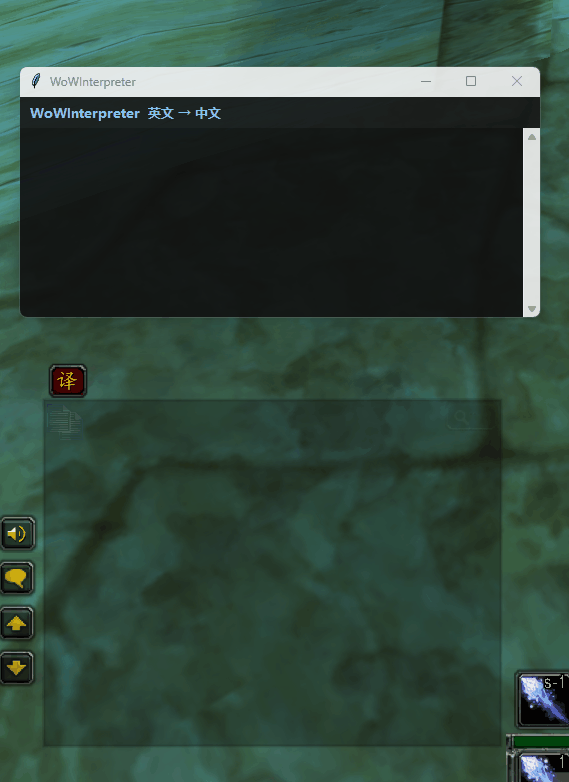

# WoWInterpreter

**English ↔ Simplified Chinese communication assistant for World of Warcraft Classic Era.**

[简体中文说明](README_zh-CN.md) · [User Guide](Documentation/WoWInterpreter-2.2.0-User-Guide-English.docx) · [中文用户指南](Documentation/WoWInterpreter-2.2.0-User-Guide-Chinese-Simplified.docx)

WoWInterpreter combines a World of Warcraft addon with a small Windows tray application. The addon transports chat text to the Windows bridge, the bridge translates between English and Simplified Chinese, and the result is shown in a scrollable overlay.

## Demo



*Real-time English ↔ Simplified Chinese communication in World of Warcraft Classic Era.*

The demo above shows WoWInterpreter translating player communication directly while playing. The in-game addon communicates with the Windows translation bridge, and the translated message is displayed in the WoWInterpreter overlay.

## Features

- English → Simplified Chinese and Simplified Chinese → English.
- Designed for whispers, party, raid, say, yell and normal player communication.
- `/wi <text>` direct translation.
- Recent-message selection with `/wi list` and `/wi last`.
- Manual and automatic translation modes.
- Scrollable translation overlay.
- Fullscreen and Windowed operation with automatic transport relocation after moves, resizes and display-mode changes.
- The overlay automatically stays clear of the transport during acquisition and relocation.
- Windows notification-area controls: Start, Stop, Status, diagnostic log and Exit.
- Translation engine is stopped until the user explicitly chooses **Start translator**.
- Bilingual English / Simplified Chinese Windows installer.
- Installer asks the user to select the WoW Classic Era `Interface\AddOns` directory.
- No separate Python installation is required when using the release installer.

## Download

For normal users, download **`WoWInterpreter-2.2.0-Setup.exe`** from the GitHub Releases page. Do not download the source ZIP unless you want to build the project yourself.

After installation:

1. Start **WoWInterpreter** from the Windows Start menu.
2. Find the **WI** icon in the notification area.
3. Right-click it and choose **Start translator**.
4. Start/restart WoW and make sure the **WoWInterpreter** addon is enabled.
5. Test with `/wi this is a test`.

The first translation after Start may take longer because the translation model is loaded on demand.

## Commands

| Command | Purpose |
| --- | --- |
| `/wi <text>` | Translate text |
| `/wi last` | Work with the latest captured message |
| `/wi list` | Show recent captured messages |
| `/wi manual` | Manual mode |
| `/wi auto` | Automatic mode |
| `/wi off` | Disable automatic translation |
| `/wi help` | Command help |

## How it works

```text
WoW chat / /wi
      ↓
WoWInterpreter addon
      ↓
KT08 visual transport (with a safe KT07 legacy fallback for older addon versions)
      ↓
Windows Bridge
      ↓
NLLB translation
      ↓
Scrollable overlay
```

The visual grid that may briefly appear during a request is part of the addon-to-Windows transport and is expected.

## Troubleshooting

If the grid appears but no translation is produced, right-click the **WI** tray icon → **Open diagnostic log**. A healthy first model load should eventually show:

```text
[BRIDGE] Loading NLLB model: facebook/nllb-200-distilled-600M
[BRIDGE] NLLB ready.
```

If CPU usage is not wanted, choose **Stop translator**. This stops the Bridge and translation engine.

`WoWInterpreter.log` is stored beside the installed executable. It rotates at
approximately 5 MiB and keeps three backups (`.1` through `.3`), for roughly
20 MiB maximum. When reporting a transport failure, attach the current log,
its recent backups if relevant, and the matching PNG/TXT diagnostic pair from
the installed `_internal/Bridge` directory. At most ten recognized diagnostic
event sets are retained. Screenshots may contain visible game content, so
inspect them before sharing.

See the complete English and Chinese guides in `Documentation/`.

## Development

Interested in contributing to WoWInterpreter or understanding how the project works internally?

See the [Development Guide](Documentation/DEVELOPMENT.md) for a detailed description of the architecture, KT08 visual transport with KT07 legacy fallback, addon/Bridge protocol, translation pipeline, debugging, performance considerations, Windows builds, testing and release process.

For contribution requirements, also see [CONTRIBUTING.md](CONTRIBUTING.md).

## Building from source

Requirements for the build machine:

- Windows
- Python
- dependencies from `requirements-runtime.txt`
- PyInstaller
- Inno Setup 6 for the final Setup executable

Run:

```bat
build_release.bat
```

The release builder creates a self-contained PyInstaller application, stages the runtime under a short path to avoid deep PyTorch path problems, and compiles the bilingual Inno Setup installer.

## Translation model and important license note

WoWInterpreter downloads/loads `facebook/nllb-200-distilled-600M` on demand through Hugging Face Transformers. The model is **not part of this repository's MIT license**. It is published separately under **CC BY-NC 4.0**, and its model card describes it as a research model rather than a production-deployment model.

This means you should review the model's terms before redistributing WoWInterpreter commercially or using it in a commercial context. See `THIRD_PARTY_NOTICES.md`.

## Privacy

WoWInterpreter performs the translation locally through the model after it has been obtained. The application uses screen capture to read the small visual transport generated by the addon. Do not treat translations as authoritative or certified translations.

## Disclaimer

WoWInterpreter is an independent community project. It is not affiliated with, endorsed by, or sponsored by Blizzard Entertainment, Meta, Hugging Face, or their affiliates. World of Warcraft and related marks belong to their respective owners.

## License

The original WoWInterpreter source code in this repository is released under the MIT License. Third-party libraries and the NLLB model retain their own licenses. See `LICENSE` and `THIRD_PARTY_NOTICES.md`.

## Code signing policy

Free code signing provided by SignPath.io, certificate by SignPath Foundation.

### Team roles

- Committers and reviewers: [maqueda](https://github.com/maqueda)
- Approvers: [maqueda](https://github.com/maqueda)

### Privacy policy

WoWInterpreter does not transfer personal information to networked systems unless specifically requested by the user or required to obtain the translation model.

The application uses local screen capture to read the visual transport generated by the WoW addon. Translation is performed locally after the translation model has been obtained.

The NLLB translation model is obtained from Hugging Face. Users should also review the privacy policies applicable to Hugging Face services used to obtain the model.
